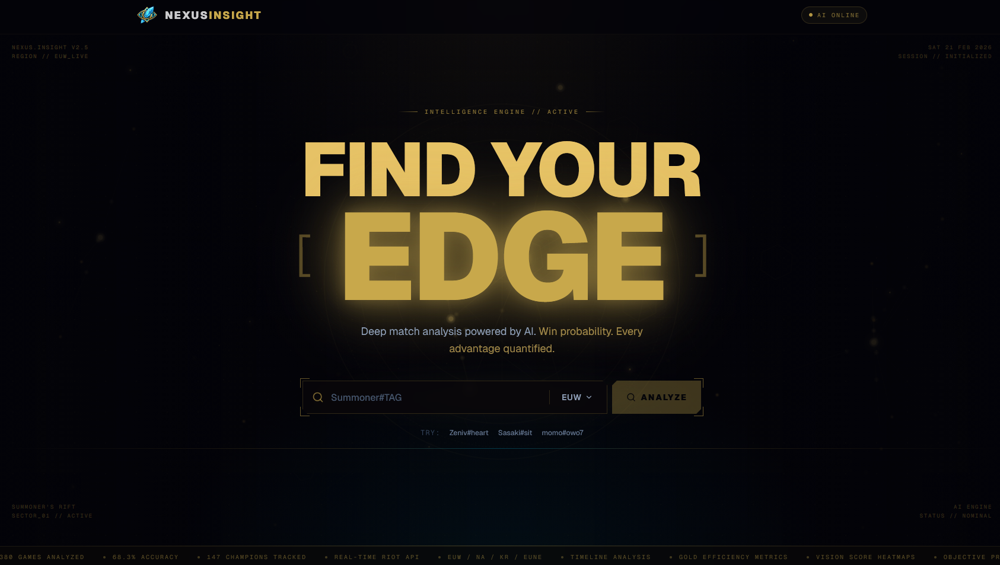

# LoL Win Prediction Analyzer

[](https://python.org)
[](https://nodejs.org)
[](https://fastapi.tiangolo.com)
[](https://nextjs.org)
[](LICENSE)
[](https://railway.app)

ML-powered League of Legends match analysis using Random Forest to identify skill-focused win drivers.



## Stack

| Layer | Tech |
|-------|------|
| Backend | FastAPI, SQLAlchemy, Scikit-learn |
| Frontend | Next.js 15, Tailwind CSS 4, Recharts |
| Database | SQLite (dev) / PostgreSQL (prod) |

## Features

- **Multi-Region** — EUW, NA, KR, BR, JP support
- **Match Analysis** — Ranked Solo/Duo breakdowns with timeline momentum
- **Performance Trends** — Combat efficiency, positioning, vision metrics
- **ML Insights** — Feature importance & win probability focused on player agency

## Quick Start

### Prerequisites
- Python 3.11+, Node.js 18+
- [Riot API Key](https://developer.riotgames.com/)

### Docker
```bash
# Create dev.env
RIOT_API_KEY=your_key
SECRET_KEY=your_secret
PLATFORM_REGION=euw1
REGIONAL_ROUTING=europe

# Run
docker-compose up --build
```
Access at `http://localhost:3000`

### Manual
```bash
# API
cd apps/api && pip install -r pyproject.toml && uvicorn main:app --reload

# Web
cd apps/web && npm install && npm run dev
```

## Railway Deployment

Create two services from the same repo:

| Service | Root Directory | Variables |
|---------|---------------|-----------|
| API | `apps/api` | `RIOT_API_KEY`, `SECRET_KEY`, `PLATFORM_REGION`, `REGIONAL_ROUTING`, `DATABASE_URL` |
| Web | `apps/web` | `NEXT_PUBLIC_API_URL` |

## Structure

```
apps/
├── api/    # FastAPI + ML pipeline
└── web/    # Next.js frontend
```

## License

[MIT](LICENSE)
